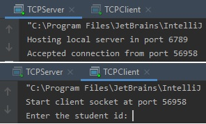
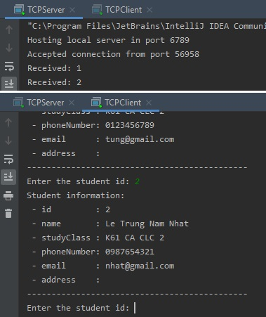
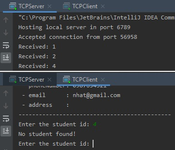
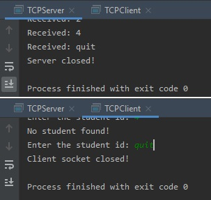

# Bài tập nhóm số 2: Thực hành với Socket

## Thông tin nhóm:
    - Nguyễn Thanh Tùng - 16020063
    - Lê Trung Nam Nhật - 16021620
    - Nguyễn Tuấn Quang - 16020273
    

## Báo cáo bài thực hành:
*Ảnh chụp màn hình thể hiện chương trình đã hoạt động*

- Khởi chạy lần lượt server socket và client socket:

- Nhập id `1`:

- Nhập id `2`:

- Nhập id `4` (không có trong danh sách sinh viên):

- Nhập `quit` để dừng client socket và server socket:

