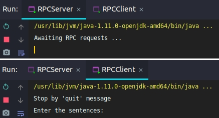
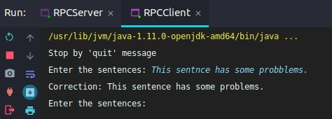
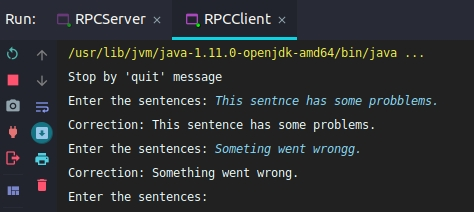
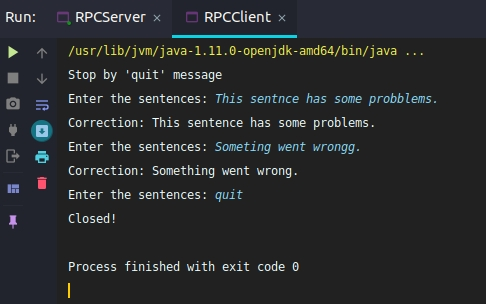

# Bài tập nhóm số 4: Thực hành với MOM

_`Message Oriented Middleware`_

## Thông tin nhóm:

    - Nguyễn Thanh Tùng - 16020063
    - Lê Trung Nam Nhật - 16021620
    - Nguyễn Tuấn Quang - 16020273

## Yêu cầu:

JDK >= 11

## Báo cáo bài thực hành

### Đề bài:

Viết ứng dụng demo kiểm tra chính tả (tiếng Anh) có sử dụng Message-oriented middleware.

### Mô tả:

Bài tập ứng dụng MOM (Message-oriented middleware) sử dụng [RabbitMQ](https://www.rabbitmq.com/) để xây dựng ứng dụng truyền tin. Thông thường, người ta có thể sử dụng _Work Queues_ để phân tán các nhiệm vụ tiêu tốn thời gian cho nhiều queue (worker) khác nhau rồi tự động gửi message từ máy remote tới máy client. Tuy nhiên, ở bài toán này, client cần chạy một hàm trên máy remote và chờ đợi kết quả trả về. Vì vậy nhóm đã sử dụng RPC (Remote Procedure Call) để đáp ứng yêu cầu đó.

Về kiểm tra chính tả, hiện tại nhóm đang sử dụng [montanaflynn-spellcheck api](https://github.com/montanaflynn/Spellcheck-API).

### Ảnh chụp màn hình thể hiện chương trình đã hoạt động

- Khởi chạy lần lượt server và client:

- Ở client, nhập câu `This sentnce has some probblems.`:

- Ở client, nhập câu `Someting went wrongg`:

- Ở client, nhập `quit` để dừng chương trình:

