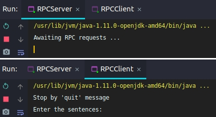
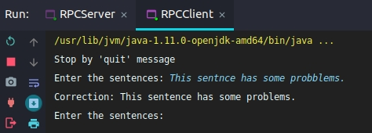
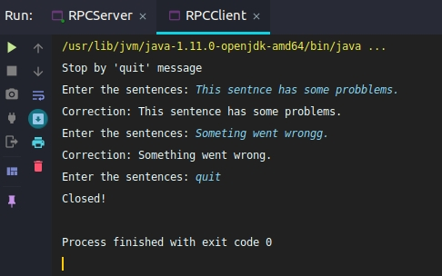

# Báo cáo bài tập lớn số 2

## Thông tin nhóm

    Nguyễn Thanh Tùng - 16020063 - K61 CA CLC2
    Lê Trung Nam Nhật - 16021620 - K61 CA CLC2
    Nguyễn Tuấn Quang - 16020273 - K61 CA CLC2

## Mục lục

**Message Oriented Middleware**

- [Middleware](#middleware)
- [Message Oriented Middleware](#message-oriented-middleware)

**RabbitMQ**

- [Tổng quan về RabbitMQ](#t%e1%bb%95ng-quan-v%e1%bb%81-rabbitmq)
- [Tiêu chuẩn AMQP trong RabbitMQ](#ti%c3%aau-chu%e1%ba%a9n-amqp-trong-rabbitmq)
- [Luồng message bên trong RabbitMQ](#lu%e1%bb%93ng-message-b%c3%aan-trong-rabbitmq)
- [Khi nào và tại sao chúng ta cần sử dụng RabbitMQ?](#khi-n%c3%a0o-v%c3%a0-t%e1%ba%a1i-sao-ch%c3%bang-ta-c%e1%ba%a7n-s%e1%bb%ad-d%e1%bb%a5ng-rabbitmq)
- [Các tính năng của RabbitMQ](#c%c3%a1c-t%c3%adnh-n%c4%83ng-c%e1%bb%a7a-rabbitmq)
- [Ứng dụng RabbitMQ](#%e1%bb%a8ng-d%e1%bb%a5ng-rabbitmq)

## Middleware

### Tổng quát

Middleware là một lớp phần mềm nằm giữa các ứng dụng và hệ điều hành. Middleware thường được sử dụng trong các hệ thống phân tán, với chức năng đơn giản hóa việc phát triển phần mềm bằng cách:

- Che đi sự phức tạp của các ứng dụng phân tán.
- Ẩn sự không đồng nhất giữa phần cứng, hệ điều hành và các giao thức.
- Cung cấp các giao diện đồng nhất giúp mở rộng chức năng hệ thống.
- Cung cấp tập hợp các dịch vụ phổ biến giúp giảm thiểu sự trùng lặp và tăng cường sự tương tác giữa các ứng dụng.

Middleware tương tự như một hệ điều hành vì nó có thể hỗ trợ các chương trình hay ứng dụng khác. Một hệ điều hành thông thường cung cấp các API cho các chương trình để sử dụng các tính năng phần cứng cơ bản. Trong khi đó Middleware cung cấp một API để sử dụng các tính năng hệ điều hành.

### Phân loại

Middleware được phân loại thành:

- Remote Procedure Call (RPC-based middleware)
- Object Request Broker (ORB-based middleware)
- Message Oriented Middleware (MOM-based middleware)

Điểm chung của cả 3 mô hình này đó là giúp kết nối hai ứng dụng hoặc nền tảng khác nhau thông qua mạng internet. Chúng khác nhau ở chỗ các phần mềm trung gian được dựa trên mô hình RPC và ORB tạo ra các hệ thống với các thành phần được liên kết chặt chẽ với nhau, trong khi các hệ thống dựa trên mô hình MOM cho phép sự liên kết giữa các thành phần lỏng lẻo hơn.

Trong một hệ thống dựa trên RPC hoặc ORB, khi một thủ tục A gọi một thủ tục B khác, nó phải đợi đến khi thủ tục B được gọi trở lại trước khi nó có thể làm bất cứ điều gì khác. Trong các mô hình này, phần mềm trung gian hoạt động một phần như một siêu liên kết, định vị thủ tục được gọi trên mạng và sử dụng các dịch vụ mạng để truyền tham số hàm hoặc phương thức cho thủ tục và sau đó trả về kết quả.

## Message Oriented Middleware

### MOM là gì?

Trong hoàn cảnh các doanh nghiệp, tổ chức phải thay đổi liên tục để phù hợp với tốc độ phát triển chóng mặt của công nghệ, các hệ thống phần mềm phục vụ cho họ cũng phải có khả năng đáp ứng những thay đổi đó. Sau khi sáp nhập, bổ sung một dịch vụ mới hoặc mở rộng các dịch vụ có sẵn, một doanh nghiệp có thể không đủ khả năng để tạo lại hệ thống thông tin của mình, thậm chí kể cả khi doanh nghiệp có đủ khả năng thì nó cũng gây lên những sự khó khăn và tốn kém. Đó là một điểm quan trọng cần tính đến khi có nhu cầu tích hợp các thành phần mới hoặc mở rộng quy mô phần mềm dựa trên các dịch vụ có sẵn một cách hiệu quả nhất có thể. Cách dễ dàng nhất giúp tích hợp các thành phần không đồng nhất với nhau không phải là tái tạo các thành phần này thành các yếu tố đồng nhất mà là cung cấp một lớp cho phép chúng giao tiếp bất chấp sự khác biệt của chúng. Lớp này, được gọi là phần mềm trung gian, cho phép các thành phần phần mềm được phát triển độc lập và chạy trên các nền tảng mạng khác nhau nhưng vẫn có thể tương tác với nhau thông qua internet.

**Message Oriented Middleware (MOM)** là một loại sản phẩm phần mềm cho phép phân phối tin nhắn trên các hệ thống công nghệ thông tin phức tạp. Các ứng dụng MOM thường tạo ra một sản phẩm phân tán tương thích với các hệ điều hành khác nhau, được cung cấp bởi phần mềm trung gian. Ngoài ra, MOM cho phép các thành phần của phần mềm tương tác với nhau hoặc chia sẻ dữ liệu. Trong các mô hình trực quan, MOM thường được biểu diễn dưới dạng một trạm trung tâm với các đường kết nối khác nhau liên quan đến việc khởi tạo thông điệp và các đích đến.

### Ưu điểm của mô hình MOM

Lý do chính của việc sử dụng giao thức MOM là do khả năng lưu trữ bộ đệm, định tuyến hoặc chuyển đổi tin nhắn trong khi truyền tin nhắn từ người gửi đến người nhận.

Một ưu điểm khác của việc sử dụng giao thức này là bằng cách sử dụng giao diện quản trị viên, bạn có thể theo dõi và điều chỉnh hiệu suất của việc gửi và nhận tin nhắn. Do đó, các ứng dụng khách được giải quyết hiệu quả mọi vấn đề ngoại trừ việc gửi, nhận và xử lý tin nhắn. Tùy thuộc vào mã của hệ thống MOM và tùy thuộc vào quản trị viên để có thể giải quyết các vấn đề như khả năng tương tác, độ tin cậy, bảo mật, khả năng mở rộng và hiệu suất.

#### Routing

Hầu hết các hệ thống MOM đều triển khai dựa trên hệ thống hàng đợi tin nhắn. Một số khác thì triển khai dựa vào phép logic định tuyến được cung cấp bởi chính lớp nhắn tin, trong khi các cài đặt khác phụ thuộc vào ứng dụng khách để cung cấp thông tin định tuyến hoặc cho phép kết hợp cả hai mô hình. Số còn lại triển khai sử dụng các mô hình _broadcast_ hoặc _multicast distribution paradigms_.

#### Transformation

Trong một hệ thống phần mềm áp dụng mô hình MOM, tin nhắn nhận được tại đích không cần thiết phải giống hệt với tin nhắn được gửi ban đầu. Hệ thống sẽ tích hợp và chuyển đổi các thông điệp trong quá trình truyền đi để phù hợp với yêu cầu của người gửi hoặc của người nhận. Kết hợp với các phương tiện định tuyến, một ứng dụng có thể gửi tin nhắn ở định dạng riêng và các ứng dụng khác có thể nhận được một bản sao của tin nhắn ở định dạng riêng mà chúng sử dụng. Nhiều hệ thống MOM hiện đại cung cấp các công cụ chuyển đổi thông điệp cho phép các lập trình viên thiết lập các quy tắc chuyển đổi mà chỉ cần thao tác kéo và thả GUI đơn giản.

#### Asynchronicity

Khi sử dụng hệ thống MOM, người dùng thực hiện gọi API để gửi tin nhắn đến đích do nhà cung cấp quản lý. Nó sẽ gọi các dịch vụ của nhà cung cấp để định tuyến và gửi tin nhắn. Sau khi đã gửi tin nhắn xong, khách hàng có thể tự tin tiếp tục thực hiện các công việc khác vì tin nhắn sẽ được nhà cung cấp giữ lại cho đến khi nó được gửi đến đích. Mô hình MOM, kết hợp với sự trung gian của nhà cung cấp, cho phép tạo ra một hệ thống các thành phần được kết nối với nhau một cách lỏng lẻo.

MOM bao gồm một danh sách các phần mềm giao tiếp liên ứng dụng thường dựa vào việc truyền thông điệp không đồng bộ. Trong các hệ thống không đồng bộ, hàng đợi tin nhắn cung cấp lưu trữ tạm thời khi chương trình đích bận hoặc không được kết nối dẫn đến không nhận được tin nhắn. Ngoài ra, hầu hết các hệ thống MOM không đồng bộ cung cấp lưu trữ liên tục để sao lưu hàng đợi tin nhắn khi xảy ra vấn đề này. Điều đó cũng có nghĩa là nếu ứng dụng người nhận không nhận được tin nhắn vì bất kỳ lý do gì, người gửi có thể tiếp tục gửi thêm tin nhắn mà không bị ảnh hưởng, vì các tin nhắn họ gửi sẽ chỉ tích lũy trong hàng đợi tin nhắn để xử lý sau khi người nhận khởi động lại và kết nối thành công.

### Nhược điểm của mô hình MOM

Nhược điểm chính của nhiều hệ thống MOM là chúng yêu cầu một thành phần bổ sung trong kiến ​​trúc, đó là tác nhân chuyển tin nhắn. Như với đối với bất kỳ hệ thống nào, việc thêm một thành phần khác có thể dẫn đến giảm hiệu suất và độ tin cậy, và cũng có thể làm cho toàn bộ hệ thống vận hành khó khăn hơn và tốn kém hơn để duy trì hoạt động.

Ngoài ra, nhiều liên lạc giữa các ứng dụng có một khía cạnh đồng bộ, đối với người gửi đặc biệt, họ muốn chờ trả lời tin nhắn trước khi tiếp tục. Bởi vì giao tiếp dựa trên thông điệp đôi khi tồn tại các chức năng không đồng bộ, cho nên nó có thể không phù hợp trong các tình huống như vậy. Điều đó cho thấy rằng, hầu hết các hệ thống MOM đều có các phương tiện để gộp một yêu cầu và phản hồi thành dạng một giao dịch giả đồng bộ.

Đối với một hệ thống nhắn tin đồng bộ, chức năng gọi sẽ không trở lại cho đến khi chức năng được gọi đã hoàn thành nhiệm vụ. Còn trong hệ thống không đồng bộ được kết nối một cách lỏng lẻo, ứng dụng khách có thể tiếp tục truyền tin nhắn cho người nhận cho đến khi tài nguyên cần thiết để xử lý công việc này bị cạn kiệt và cuộc gọi sẽ thất bại. Tất nhiên, những điều kiện này có thể được giảm thiểu hoặc tránh bằng cách theo dõi hiệu suất và điều chỉnh luồng thông báo, tuy nhiên đây là công việc không cần thiết với hệ thống nhắn tin đồng bộ. Điều quan trọng là ta cần phải hiểu những lợi thế và rủi ro của từng loại hệ thống. Mỗi hệ thống phù hợp cho các loại nhiệm vụ khác nhau. Đôi khi, chúng ta cần phải có sự kết hợp của cả hai loại hệ thống để có được hành vi mong muốn.

# [RabbitMQ](https://www.rabbitmq.com/)

## Tổng quan về RabbitMQ

**RabbitMQ** là một _message broker_ ( message-oriented middleware), triển khai giao thức Advanced Message Queue Protocol (AMQP). Sau này, RabbitMQ phát triển hỗ trợ các giao thức khác như Streaming Text Oriented Messaging Protocol (STOMP), Message Queuing Telemetry Transport (MQTT),... Hiểu đơn giản thì RabbitMQ có vai trò như là một trung gian để điều phối và gửi nhận các message giữa các producer (ứng dụng nguồn, nơi gửi đi message) và consumer (nơi tiếp nhận message). Một ứng dụng có thể vừa là producer vừa là consumer.

Một message bao gồm bất cứ loại thông tin nào, có thể là yêu cầu, một tiến trình hoặc đơn giản chỉ là một text message. Các message sẽ được lưu trữ trong hàng đợi (queue) cho đến khi cần được sử dụng. Một queue chỉ bị ràng buộc bởi giới hạn bộ nhớ và ổ đĩa của máy chủ. Một queue có thể nhận message từ nhiều producer và gửi message đến nhiều consumer.

## Tiêu chuẩn AMQP trong RabbitMQ

**AMQP** (Advanced Message Queue Protocol) là một chuẩn giao thức cho phép khả năng tương tác message giữa các hệ thống với nhau. Các tính năng của AMQP bao gồm message orientation, queuing, routing (point-to-point và publish-and-subscribe), tính an toàn và bảo mật.

AMQP cung cấp khả năng kiểm soát luồng, giao tiếp hướng message (message-oriented) giữa các hệ thống với việc gửi nhận message với các đảm bảo truyền nhận message chẳng hạn như:

- `tối đa gửi một lần` (at most once delivery): mỗi message được gửi đi duy nhất 1 lần hoặc không.
- `ít nhất gửi một lần` (at least once delivery): mỗi message sẽ chắc chắn được gửi đi, nhưng có thể nhiều lần.
- `chính xác một lần` (exactly once): message luôn luôn đến và chỉ một lần.

### Các thành phần trong mô hình AMQP:

- **Queue**:
  Nơi lưu trữ tạm thời các message cho đến khi được sử dụng

- **Exchange**:
  Một queue muốn nhận message phải ràng buộc với ít nhất một exchange, việc định tuyến message đến queue phụ thuộc vào loại exchange được dùng.

- **Binding**:
  Ràng buộc (binding) là mối liên kết giữa queue và exchange gồm các tập luật mà exchange sử dụng để định tuyến message đến queue.

- **Message**:
  Message được gửi từ producer đến queue và được sử dụng bởi consumer. Mỗi tin nhắn có một tập các headers để xác định các thuộc tính thời lượng, độ ưu tiên,...

## Luồng message bên trong RabbitMQ

Các message được `producer` (publisher) phát đi tới các `exchange` (có vai trò tương tự hòm thư trong thực tế). `Exchange` sau đó phân phát các nhân bản của message tới các `queue`, dựa trên các luật được gọi là `binding` (ràng buộc). `Queue` sẽ lưu trữ message cho đến khi tồn tại `consumer` sẵn sàng nhận message. Sau đó, `broker` (ở đây là _RabbitMQ_) sẽ gửi message đến cho các `consumer` đã đăng ký nhận message, hoặc các `consumer` nạp (fetch) message khi cần từ queue tương ứng.

#### Exchange

Exchange gồm các loại như sau sau:

- **Direct exchange**: đưa message vào queue dựa theo khóa định tuyến (`routing key`). Message được gửi đến queue có routing key khớp với routing key của message.

  _Ví dụ_: Một queue được ràng buộc với exchange bởi routing key `X` thì message được gửi đến exchange có routing key `X` sẽ được định tuyến đến queue đó.

- **Default exchange**: là một direct exchange không có tên (string rỗng) được khai báo sẵn bởi broker. Mọi queue được tạo sẽ tự động được liên kết với nó bằng một routing key giống với tên queue.

- **Fanout exchange**: định tuyến các message đến toàn bộ các queue gắn với nó.

- **Topic exchange**: định tuyến message dựa trên sự tương đồng giữa routing key và pattern khai báo trong ràng buộc.

- Header exchange: định tuyến dựa trên header của message.

#### Queue

Queue trong mô hình AMQP có cùng một vài thuộc tính với exchange nhưng cũng có thêm các thuộc tính sau:

- `name (string)`: nếu để rỗng, broker sẽ tự động sinh một tên riêng biệt.
- `durable (boolean)`: nếu `true`, queue sẽ không bị mất đi nếu broker gặp lỗi và phải khởi động lại. Tuy nhiên message nằm trong hàng đợi đó thì chưa chắc.
- `exclusive (boolean)`: được sử dụng chỉ với 1 kết nối và queue sẽ bị xoá khi kết nối đó bị đóng.
- `auto-delete (boolean)`: queue có ít nhất một consumer sẽ bị xoá khi consumer cuối cùng huỷ đăng ký nhận message từ nó.

#### Binding

Ràng buộc (binding) được tạo khi message từ exchange đến queue, việc đưa tin nhắn vào queue phụ thuộc vào thuộc tính của tin nhắn, ví dụ như routing key của direct exchange.

Trong mô hình AMQP, có 2 cách để consumer nhận và xử lý message đó là: có message được gửi tới chúng (push API) hoặc chủ động nạp message khi cần (pull API). Mỗi consumer có một xâu ký tự định danh gọi là consumer tag, được dùng để huỷ đăng ký nhận message.

**Xác nhận**: Các ứng dụng consumer đôi khi có thể không xử lý các message riêng lẻ hoặc đôi khi gặp sự cố. Ngoài ra còn có khả năng xuất hiện các vấn đề về mang. Vậy khi nào thì broker nên quá message khỏi queue? Đặc tả AMQP cho phép consumer kiểm soát điều này qua 2 chế độ xác nhận (acknowledgement): Sau khi broker gửi message đến ứng dụng (`basic.deliver` hoặc `basic.get-ok`), hoặc sau khi ứng dụng gửi lại một xác nhận (`basic.ack`).

Nếu một consumer chết mà không gửi lại xác nhận, broker sẽ gửi lại message tới một consumer khác. Nếu không có consumer nào sẵn sàng, broker sẽ chờ đến khi có ít nhất một consumer đăng ký tới cùng queue trước khi thử gửi lại message.

**Từ chối tin nhắn**: Khi một consumer nhận được một tin nhắn, việc xử lý có thể hoặc không thể thành công. Một consumer có thể cho broker biết rằng đã xử lý message lỗi bằng cách từ chối một message. Khi đó, consumer có thể yêu cầu broker bỏ qua nó, hoặc đưa lại nó vào queue.

## Khi nào và tại sao chúng ta cần sử dụng RabbitMQ

### Vấn đề:

Vấn đề của một hệ thống phân tán (distributed system) là bao gồm rất nhiều thành phần. Các thành phần đó lại cần kết nối và đồng bộ với nhau. Nếu như liên kết trực tiếp như các ứng dụng thông thường khác thì sẽ có rất nhiều kết nối. Điều này gây rắc rối trong việc code cũng như mở rộng và bảo trì. Ngoài ra, việc gọi chéo các service quá nhiều sẽ khiến luồng xử lý rất phức tạp đối với lập trình viên.

### Lợi ích khi sử dụng RabbitMQ:

- Giúp các phần mềm kết nối với nhau và mở rộng.

- Hỗ trợ hầu hết các ngôn ngữ thông dụng hiện nay. Điều này giúp cho producer và consumer làm việc với nhau mà không cần quan tâm phía bên kia dùng ngôn ngữ gì, chỉ cần gửi message thỏa mãn giao thức là được.

- Xử lý bất đồng bộ (asynchronous). Producer chỉ việc gửi các message đến mà không cần phải đợi phản hồi từ consumer. Khi nào cần xử lý thì consumer sẽ lấy message về.

## Các tính năng của RabbitMQ

- **Tính tin cậy**:
  RabbitMQ cung cấp nhiều tính năng gia tăng độ tin cậy như: persistence, delivery acknowledgements, publisher confirms, high availability,.. nhưng bù lại phải đánh đổi bằng hiệu năng.

- **Tính sẵn sàng**:
  Các queue có thể được nhân lên trên một cụm máy để đảm bảo rằng ngay cả trong trường hợp lỗi phần cứng, message vẫn an toàn.

- **Đa giao thức**:
  RabbitMQ cung cấp khả năng truyền nhận message qua nhiều giao thức khác nhau

- **Plugin system**:
  RabbitMQ cung cấp nhiều plugin mở rộng nhiều cách khác nhau và bạn cũng có thể tự viết riêng plugin của mình.

- **Khả năng truy vết**:
  Khi chuyển message có vấn đề thì RabbitMQ sẽ hỗ trợ truy vết để tìm ra lỗi đó.

## Ứng dụng RabbitMQ

### Đề bài

Viết ứng dụng demo kiểm tra chính tả (tiếng Anh) có sử dụng Message-oriented middleware. Nhóm chọn [RabbitMQ](https://www.rabbitmq.com/).

### Thiết kế

Thông thường, một hệ thống sử dụng message queue thường được xây dựng theo kiểu một chiều. Tức là luồng duy nhất trên hệ thống là đường đi của message, từ producer, qua exchange, được đẩy vào queue và cuối cùng là đến với consumer. Message được gửi từ producer khi nào nó muốn, và consumer nhận message từ queue một cách bị động.

Tuy nhiên, ở bài toán này, consumer (client) cần gọi một hàm trên máy producer (remote), hàm sửa lỗi chính tả, và chờ đợi kết quả trả về. Vì vậy nhóm đã sử dụng **RPC (Remote Procedure Call)** để đáp ứng yêu cầu đó.
Về kiểm tra chính tả, hiện tại nhóm đang sử dụng [montanaflynn-spellcheck api](https://github.com/montanaflynn/Spellcheck-API).

### Triển khai

Ta thấy, một máy client gửi một _request message_ và server phản hồi với một _response message_. Khi đó, cần gửi thêm một địa chỉ của queue `callback` để nhận response trả về. Nói cách khác, nhóm đã sử dụng 1 queue để chứa request đến server, và 1 queue cho mỗi client để chứa response trả về từ `callback`.

Tuy nhiên, khi nhận được response trong `callback` queue, client sẽ không rõ nó thuộc về request nào. Do vậy, cần thêm một thuộc tính `correlationId` là giá trị để phân biệt các request, response với nhau. Sau này khi nhận được một response message trong `callback` queue, RabbitMQ sẽ tự động khớp nó với request message tương ứng dựa trên `correlationId`.

Tổng quan, với mỗi RPC request, máy client gửi một message với 2 thuộc tính `replyTo` (để chỉ định `callback` queue) và `correlationId` (để chỉ định response tương ứng). Request được gửi tới queue của server, server chờ đợi và xử lý tuần tự các request từ queue này rồi trả kết quả ngược về client, thông qua queue từ trường `replyTo`. Client chờ trên `callback` queue, nhận message, khớp giá trị `correlationId` với request rồi trả response về cho ứng dụng.

### Ảnh chụp màn hình thể hiện chương trình đã hoạt động

- Khởi chạy lần lượt server và client:

- Ở client, nhập câu `This sentnce has some probblems.`:

- Ở client, nhập câu `Someting went wrongg`:

- Ở client, nhập `quit` để dừng chương trình:

### [Source code](https://github.com/dgbttn/Service-Oriented-Architecture/tree/master/src/main/java/MessageOrientedMiddleware)
