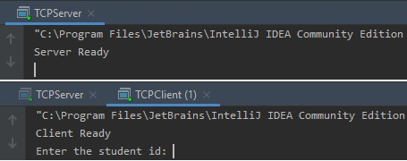
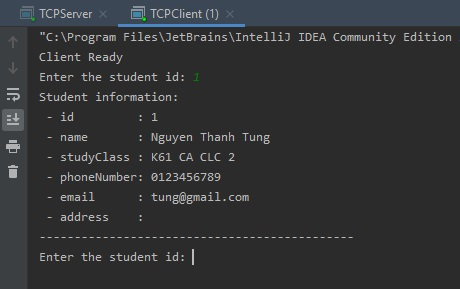
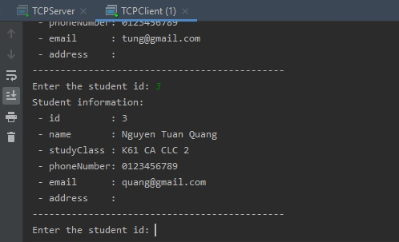
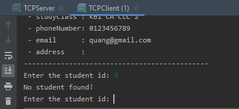
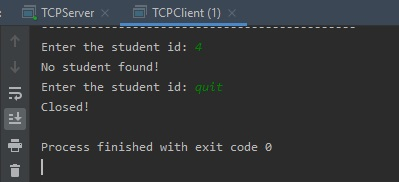

# Bài tập nhóm số 3: Thực hành với RMI

_`Remote Method Invocation`_

## Thông tin nhóm:

    - Nguyễn Thanh Tùng - 16020063
    - Lê Trung Nam Nhật - 16021620
    - Nguyễn Tuấn Quang - 16020273

## Báo cáo bài thực hành:

_Ảnh chụp màn hình thể hiện chương trình đã hoạt động_

- Khởi chạy lần lượt server và client:

#### Ở client, làm lần lượt:

- Nhập id `1`:

- Nhập id `3`:

- Nhập id `4` (không có trong danh sách sinh viên):

- Nhập `quit` để dừng chương trình:

